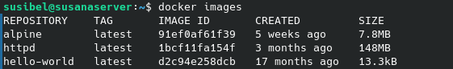
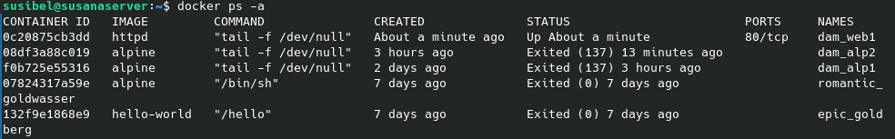
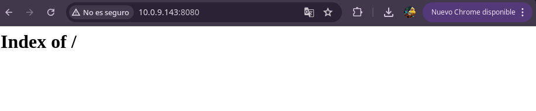
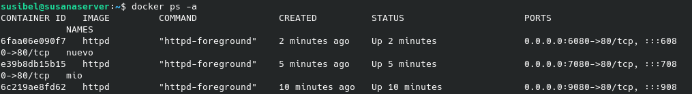
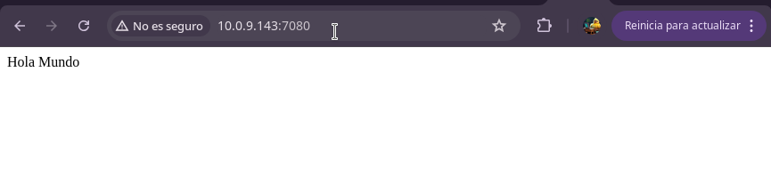
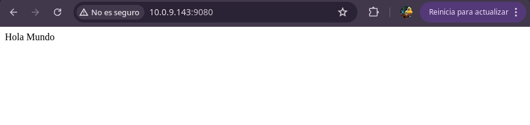
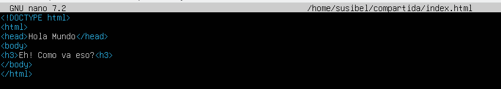
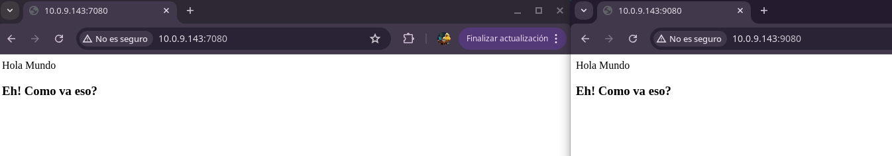

# Tarea03-SXE

Utiliza la imagen de Apache, tag 2.4 y apoyandote en la mini guía de docker sigue las instrucciones:

### 1.- Descarga la imagen 'httpd' y comprueba que está en tu equipo.
Descargamos la imagen de httpd con el comando:

``docker pull httpd``

y lo comprobamos con los comandos:

``docker images``

### 2.- Crea un contenedor con el nombre 'dam_web1'.
Creamos el contenedor con el siguiente comando:

``sudo docker run -it --name dam_web1 httpd tail -f /dev/null``

### 3.- Si quieres poder acceder desde el navegador de tu equipo, ¿qué debes hacer?
Con un big mount, podemos acceder desde el navegador del equipo a la carpeta del contenedor. Cuando se usa run creamos otro contenedor y su carpeta que compartiremos con el equipo. 
Para ello vamos a utilizar el comando:

``docker run -p 8080:80 -v /home/miusuario/miCarpeta:/usr/local/apache2/htdocs --name dam_web3 httpd``

En la imagen podemos ver el mapeo que se hace con el IP y el puerto:

### 4.- Utiliza bind mount para que el directorio del apache2 'htdocs' esté montado un directorio que tu elijas.Realiza un 'hola mundo' en html y comprueba que accedes desde el navegador.
Creamos un archivo html de Hola Mundo en una carpeta, y creamos  un nuevo contenedor de ese archivo:

``docker run -p 7080:80 -v /home/susibel/compartida:/usr/local/apache2/htdocs --name mio httpd``

Luego de ejecutar el contenedor lo visualizamos en la pagina con el IP y el puerto.

### 5.- Crea otro contenedor 'dam_web2' con el mismo bind mount y a otro puerto, por ejemplo 9080.
Creamos un contenedor nuevo con el puerto 9080 con el siguiente comando:

``docker run -p 9080:80 -v /home/miusuario/miCarpeta:/usr/local/apache2/htdocs --name dam_web2 httpd``

Mostramos en la web con el IP y puerto.

### 6.- Comprueba que los dos servidores 'sirven' la misma página, es decir, cuando consultamos en el navegador:
http://localhost:9080 

http://localhost:8000

``docker run -p 9080:80 -v /home/susibel/compartida:/usr/local/apache2/htdocs --name dam_web2 httpd``

``docker run -p 7080:80 -v /home/susibel/compartida:/usr/local/apache2/htdocs --name mio httpd``

### 7.- Realiza modificaciones de la página y comprueba que los dos servidores 'sirven' la misma página
Vamos a editar el archivo html del contenedor mio con el comando:

``sudo nano /home/susibel/compartida/index.html``

Luego actualizamos las páginas y vemos la modificación en ambos servidores. 

